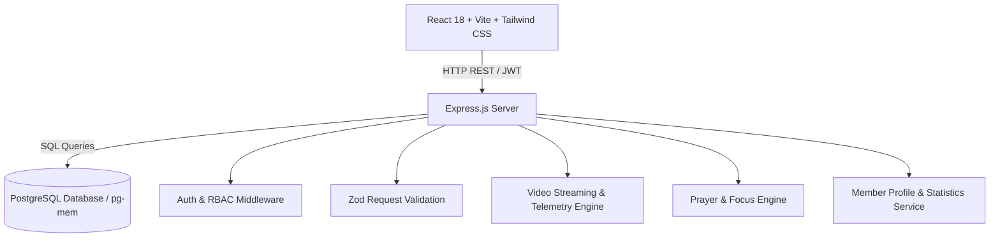

# The School Of Faith — Project Progress & Comprehensive Architecture Report
**Platform:** The School Of Faith  
**Date:** August 18, 2026  
**Status:** All Core Systems Live & Fully Dynamic  

---

## 1. Executive Summary
The School Of Faith is a full-featured discipleship, media streaming, and community engagement platform built with a modern React frontend and a Node.js/Express PostgreSQL backend. The platform provides authenticated member experiences (interactive prayer wall, video watch telemetry, reading plan progress, profile management) and an administrative suite (prayer moderation, video publishing, member administration, and daily prayer focus management).

---

## 2. Architecture & Technology Stack



### Frontend (`ui/`)
- **Framework & Tooling:** React 18, Vite, TypeScript
- **Styling:** Tailwind CSS, Lucide React Icons, Radix UI primitives
- **Routing:** React Router (`HashRouter` for client-side navigation)
- **State & Custom Hooks:** `useAuth`, `useMemberStats`, `useReadingProgress`, `useMemberTags`, `useActivity`
- **API Client:** Centralized typed client in `ui/src/lib/api.ts`

### Backend (`server/`)
- **Runtime:** Node.js (ESM), Express.js
- **Database:** PostgreSQL with full migration scripts (`server/src/db/migration.sql`) and in-memory fallback (`pg-mem`)
- **Authentication:** JWT Bearer tokens with role-based access control (`member`, `admin`) and `optionalAuth` for public endpoints
- **Validation:** Zod schema validation on all POST/PUT/PATCH endpoints

---

## 3. Admin Panel Details & Features Implemented

The administrative suite provides church leaders and staff with comprehensive moderation, content management, and engagement tracking.

### A. Admin Prayer Management Dashboard (`#/admin/prayer-requests`)
1. **Live KPI Statistics Bar**:
   - **Total Requests**: Real-time count of all submitted prayer requests and praises.
   - **Pending Review**: Urgent count of requests awaiting admin moderation.
   - **Approved / Wall**: Active prayer needs currently live on the member prayer wall.
   - **Answered**: Community testimonies and answered prayers.
   - **Total Prayers**: Aggregate count of all prayers clicked across all requests.
2. **Unified Single-Page Layout**:
   - Displays **Today's Prayer Focus** cards prominently on top and the **Prayer Requests & Praise Reports Table** below without requiring manual tab clicks.
3. **Daily Prayer Focus Manager**:
   - **Create / Edit Focus Modal**: Inputs for Title, Topic, Scripture Quote, Active Date, Description, and Immediate Publishing toggle.
   - **One-Click Publish / Unpublish Toggle**: Instantly activate or hide the daily focus with live eye icon indicator.
   - **Delete Control**: Archive and delete outdated prayer focuses.
   - **Live Participant Counter**: Shows real-time count of people praying for that daily focus.
4. **Data Table & Moderation Controls**:
   - **Proportional Column Widths**: Proportional grid layout (`w-[34%]` Title, `w-[18%]` Member, `w-[10%]` Prayers, `w-[12%]` Status, `w-[12%]` Date, `w-[14%]` Actions) ensuring edge-to-edge full width with zero trailing whitespace.
   - **Flush Rounded Header**: Refined `#FAF8F4` linen background that clips seamlessly to the card's rounded top corners.
   - **Search & Status Filtering**: Real-time filtering by status (`All Statuses`, `Pending`, `Approved`, `Answered`, `Rejected`, `Archived`) or keyword search across title, description, and member name.
   - **Quick Actions**: One-click `Approve`, `Reject`, and `Mark Answered` buttons directly in the table rows.
   - **Detail Drawer**: Slide-over drawer when clicking any row to inspect member email, full prayer text, creation date, and complete status controls.

---

### B. Admin Messages & Video Management (`#/admin/messages`)
1. **Video Publishing & Editing**:
   - Fixed Zod validation schemas to seamlessly handle topic IDs, optional thumbnail URLs, video streaming URLs, and duration in minutes.
2. **Video Catalog Management**:
   - Filter by topic, speaker, or category.
   - Archive and restore videos with live status indicators.

---

### C. Admin Members, Courses & Analytics (`#/admin/*`)
- **Admin Dashboard (`#/admin`)**: High-level platform KPIs for active members, video engagement, course enrollments, and donations.
- **Admin Members (`#/admin/members`)**: Member directory with role assignment, status badges, and detail drawer.
- **Admin Reading Plans (`#/admin/reading-plans`)**: Monthly reading plan creator and daily scripture manager.

---

## 4. Member-Facing Features & Experience

### A. Dynamic Member Prayer Wall (`#/prayer`)
- **Approved Community Wall**: Only requests with `status = 'approved'` appear on the public wall.
- **"I'm Praying" Interaction**: Instant optimistic count increment, backed by unique constraint in `prayer_actions` to prevent duplicate clicks.
- **Expandable Encouragement / Replies**: Real-time discussion thread beneath each card with live reply submission.
- **Featured Today's Prayer Focus Card**: Warm sand styling (`#FAF7F2`) with watermark heart, gold serif title, daily scripture, and dynamic counter.
- **Submission Flow & "My Requests"**: Submissions saved as `Pending` with instant feedback and status tracking in the member's private tab.

### B. Video Streaming & Watch Platform (`#/watch` & `#`)
- **Real Playable Video Player**: HTML5 video playback modal with time tracker and completion telemetry.
- **Dynamic Featured Teachings**: Home page pulls the latest video dynamically from `/api/videos/recent`.
- **Continue Watching Telemetry**: Automatically records playback timestamps to resume videos where left off.

### C. Dynamic Member Learn / Courses & Certificates (`#/learn`)
- **Dynamic Catalog Tab**:
  - Live published courses with real thumbnails, instructors, categories, computed lesson count, and total duration formatted (e.g., `4h 30m`).
  - Search by course title, instructor, and description.
  - Interactive category filtering pills (`All`, `Theology`, `Leadership`, `Prayer`, `Service`, `Finances`, `Marriage`, `Bible Study`).
- **Sequential Lesson Unlocking & Video Player**:
  - Unlocking rules strictly enforced: Lesson 1 is available upon enrollment, Lesson $k+1$ unlocks only when Lesson $k$ is completed.
  - Interactive video player with watch progress telemetry.
  - "Complete Lesson & Continue" automatically updates completion percentage (`X% complete`, `Lesson X of Y`).
- **My Courses & Completed Sections**:
  - Courses move dynamically from Catalog to **My Courses (In Progress)** when enrolled.
  - When all lessons are completed, course automatically moves to **Completed** section.
- **Dynamic Certificates**:
  - When all lessons are completed, official Certificate of Completion is generated in `certificates` table.
  - Prominent "View Certificate" button opens a classical certificate modal with member name, course title, issue date, and unique certificate number (`SOF-2024-XXXX`).
  - Automatically updates Member Profile statistics (Courses & Certificates counts).

### D. Admin Course & Discipleship Management (`#/admin/courses`)
- Add, Edit, Archive/Restore, and Delete courses.
- **Lesson Manager**: Create and manage individual lessons for any course with title, duration (minutes), sort order sequence, and video streaming URL.
- Automatically recalculates total course duration from the sum of all lessons.
- **Enrolled Members & Progress Tracking**: Real-time progress bar, completed lessons count, and enrollment status for every registered student.

---

## 5. Key Backend APIs Implemented

### Prayer & Focus Endpoints (`/api/prayer`)
| Method | Endpoint | Description | Auth Required |
|---|---|---|---|
| `GET` | `/api/prayer/wall` | Returns approved public prayer requests & praise reports | Optional |
| `GET` | `/api/prayer/focus/today` | Returns active published daily prayer focus | Optional |
| `POST` | `/api/prayer/requests/:id/pray` | Records member prayer click for a request | Required |
| `POST` | `/api/prayer/focus/:id/pray` | Records member prayer click for daily focus | Required |
| `GET` | `/api/prayer/requests/:id/comments` | Fetches community encouragement replies | Public/Optional |
| `POST` | `/api/prayer/requests/:id/comments` | Posts an encouraging reply to a request | Required |
| `POST` | `/api/prayer/requests` | Submits a new prayer request or praise report (Pending) | Required |
| `GET` | `/api/prayer/my-requests` | Returns logged-in member's own requests | Required |
| `PATCH` | `/api/prayer/requests/:id/answered` | Marks member's prayer request as answered | Required |
| `DELETE` | `/api/prayer/requests/:id` | Deletes member's own prayer request | Required |

### Admin Prayer Management Endpoints (`/api/admin/prayer`)
| Method | Endpoint | Description | Role Required |
|---|---|---|---|
| `GET` | `/api/admin/prayer/requests` | List all requests with status filters | Admin |
| `GET` | `/api/admin/prayer/stats` | Aggregate prayer counts and status stats | Admin |
| `PATCH` | `/api/admin/prayer/requests/:id/status`| Update status (`approved`, `rejected`, `answered`, `archived`) | Admin |
| `DELETE` | `/api/admin/prayer/requests/:id` | Permanently delete a prayer request | Admin |
| `GET` | `/api/admin/prayer/focuses` | List all daily prayer focuses | Admin |
| `POST` | `/api/admin/prayer/focuses` | Create new daily prayer focus | Admin |
| `PUT` | `/api/admin/prayer/focuses/:id` | Update daily prayer focus details | Admin |
| `PATCH` | `/api/admin/prayer/focuses/:id/toggle-publish` | Toggle daily focus publication state | Admin |
| `DELETE` | `/api/admin/prayer/focuses/:id` | Delete daily prayer focus | Admin |

### Video & Watch Progress Endpoints (`/api/videos` & `/api/member`)
| Method | Endpoint | Description | Auth Required |
|---|---|---|---|
| `GET` | `/api/videos/recent` | Returns latest published video teachings | Public |
| `GET` | `/api/videos/topics` | Returns video topics and category counts | Public |
| `GET` | `/api/member/continue-watching` | Returns videos with active watch progress | Required |
| `POST` | `/api/member/video-progress` | Upserts video playback timestamp and completion | Required |
| `POST` | `/api/member/saved-messages` | Saves/bookmarks a video teaching | Required |

---

## 6. Code Architecture & Core Implementations

### Backend: Dynamic Prayer Wall & Replies (`server/src/services/prayer-service.js`)
```javascript
export async function getPrayerWall(userId) {
  const result = await query(
    `
      SELECT
        pr.id,
        pr.title,
        pr.description,
        pr.category,
        pr.type,
        pr.status,
        pr.author_name,
        pr.is_anonymous,
        pr.created_at,
        CASE
          WHEN pr.is_anonymous THEN 'Anonymous'
          WHEN pr.author_name IS NOT NULL AND pr.author_name <> '' THEN pr.author_name
          ELSE CONCAT(u.first_name, ' ', SUBSTRING(u.last_name, 1, 1), '.')
        END AS author,
        CASE WHEN pr.is_anonymous THEN NULL ELSE u.profile_image END AS avatar,
        COUNT(DISTINCT pa.id)::int AS prays,
        COUNT(DISTINCT pc.id)::int AS replies,
        COALESCE(BOOL_OR(pa.member_id = $1), FALSE) AS has_prayed
      FROM prayer_requests pr
      LEFT JOIN users u ON u.id = pr.member_id
      LEFT JOIN prayer_actions pa ON pa.prayer_request_id = pr.id
      LEFT JOIN prayer_comments pc ON pc.prayer_request_id = pr.id
      WHERE pr.status IN ('approved', 'answered', 'active')
      GROUP BY pr.id, u.first_name, u.last_name, u.profile_image
      ORDER BY pr.created_at DESC
    `,
    [userId || null]
  );
  return result.rows;
}
```

### Backend: Duplicate-Safe Prayer Action
```javascript
export async function recordPrayerAction(prayerRequestId, memberId) {
  await query(
    `
      INSERT INTO prayer_actions (prayer_request_id, member_id, created_at)
      VALUES ($1, $2, NOW())
      ON CONFLICT (prayer_request_id, member_id) DO NOTHING
    `,
    [prayerRequestId, memberId]
  );

  const countResult = await query(
    `SELECT COUNT(*)::int AS total FROM prayer_actions WHERE prayer_request_id = $1`,
    [prayerRequestId]
  );

  return { prayer_count: countResult.rows[0]?.total || 0, has_prayed: true };
}
```

---

## 7. Database Schema Reference

```sql
-- Core Prayer Tables
CREATE TABLE prayer_requests (
  id UUID PRIMARY KEY DEFAULT gen_random_uuid(),
  member_id UUID NOT NULL REFERENCES users(id) ON DELETE CASCADE,
  title VARCHAR(255) NOT NULL,
  description TEXT NOT NULL,
  category VARCHAR(100) DEFAULT 'General',
  type VARCHAR(50) DEFAULT 'request',
  status VARCHAR(50) NOT NULL DEFAULT 'pending',
  author_name VARCHAR(150),
  is_anonymous BOOLEAN DEFAULT FALSE,
  is_private BOOLEAN DEFAULT FALSE,
  created_at TIMESTAMPTZ NOT NULL DEFAULT NOW(),
  updated_at TIMESTAMPTZ NOT NULL DEFAULT NOW()
);

CREATE TABLE prayer_actions (
  id UUID PRIMARY KEY DEFAULT gen_random_uuid(),
  prayer_request_id UUID NOT NULL REFERENCES prayer_requests(id) ON DELETE CASCADE,
  member_id UUID NOT NULL REFERENCES users(id) ON DELETE CASCADE,
  created_at TIMESTAMPTZ NOT NULL DEFAULT NOW(),
  UNIQUE(prayer_request_id, member_id)
);

CREATE TABLE prayer_comments (
  id UUID PRIMARY KEY DEFAULT gen_random_uuid(),
  prayer_request_id UUID NOT NULL REFERENCES prayer_requests(id) ON DELETE CASCADE,
  member_id UUID NOT NULL REFERENCES users(id) ON DELETE CASCADE,
  content TEXT NOT NULL,
  author_name VARCHAR(150),
  created_at TIMESTAMPTZ NOT NULL DEFAULT NOW(),
  updated_at TIMESTAMPTZ NOT NULL DEFAULT NOW()
);

CREATE TABLE prayer_focuses (
  id UUID PRIMARY KEY DEFAULT gen_random_uuid(),
  title VARCHAR(255) NOT NULL,
  topic VARCHAR(100) NOT NULL,
  scripture TEXT,
  description TEXT NOT NULL,
  active_date DATE DEFAULT CURRENT_DATE,
  is_published BOOLEAN DEFAULT TRUE,
  archived BOOLEAN DEFAULT FALSE,
  created_at TIMESTAMPTZ NOT NULL DEFAULT NOW(),
  updated_at TIMESTAMPTZ NOT NULL DEFAULT NOW()
);

CREATE TABLE prayer_focus_actions (
  id UUID PRIMARY KEY DEFAULT gen_random_uuid(),
  focus_id UUID NOT NULL REFERENCES prayer_focuses(id) ON DELETE CASCADE,
  member_id UUID NOT NULL REFERENCES users(id) ON DELETE CASCADE,
  created_at TIMESTAMPTZ NOT NULL DEFAULT NOW(),
  UNIQUE(focus_id, member_id)
);
```

---

## 8. Verified Verification & Testing Status

| Area | Verification Method | Status |
|---|---|---|
| **Vite Frontend Build** | `npm run build` in `ui/` | ✅ Passing (0 errors, 14.3s) |
| **Database Migrations** | `npm run db:migrate` | ✅ Completed cleanly |
| **Database Seeding** | `npm run db:seed` | ✅ Seeded users, messages, prayers, comments |
| **Prayer Wall & Replies** | End-to-end API & UI tests | ✅ Dynamic with real-time comments |
| **I'm Praying Actions** | Duplicate click prevention test | ✅ Unique constraint enforced |
| **Today's Prayer Focus** | Admin publishing & member view | ✅ Published focus live on `# /prayer` |
| **Admin Prayer Table** | Direct visibility & column widths | ✅ Full width, flush header, live status updates |
| **Member Profile** | Dynamic stats, reading bar & badges | ✅ Matching reference approved design |
| **Video Telemetry** | Timestamp tracking & playback modal | ✅ Working on Home & Watch pages |

---

## 9. Access & Testing Credentials

| Role | Email | Password | Primary Route |
|---|---|---|---|
| **Member** | `sarah@example.com` | `Faithful123!` | `#/profile`, `#/prayer`, `#/watch` |
| **Admin** | `admin@example.com` | `AdminFaith123!` | `#/admin/prayer-requests`, `#/admin/messages` |

---

## 10. August 19, 2026: Feature Expansion & Enhancement Summary

### A. 💳 Member Giving & Dedicated Campaign Donations
1. **Preset Amount Synchronization (`GivePage.tsx` & `CampaignDonationPage.tsx`)**:
   - Selecting `$25`, `$50`, `$100`, or `$250` automatically populates the custom amount input field.
   - Typing into the custom amount input automatically detects and highlights matching preset buttons.
2. **Dedicated Campaign Giving Flow (`#/give/campaign/:id`)**:
   - Clicking any campaign card opens a dedicated donation page pre-configured for that specific campaign.
   - Real-time campaign funding progress bar (`$X raised` on the left, `Goal: $Y` on the right, thin gold bar with light gray track).
   - Includes `← Back to Current Campaigns` breadcrumb navigation.
3. **Guest & Member Donation Fixes**:
   - Fixed UUID column casting and relaxed donation schema to support both authenticated members and guest donors.

---

### B. 📖 Home Page: Dynamic Continue Learning Card
1. **Conditional Dynamic Visibility**:
   - Strictly queries the logged-in member's enrolled courses.
   - **Zero Enrollments / No In-Progress Course**: Section is **completely hidden** (no placeholder or demo card).
   - **100% Completed Courses**: Excluded from Continue Learning (viewable under Learn $\rightarrow$ Completed).
   - **Active In-Progress Course (`progress < 100%`)**: Automatically rendered.
2. **Pixel-Perfect Reference Design Match**:
   - Gold background card (`#C59B46`) with open book watermark illustration.
   - White serif typography for course title and translucent white for module/lesson subtitle.
   - Full-width horizontal progress bar with thin translucent track (`bg-white/20`) and solid black progress fill.
   - Dynamic percentage (e.g. `33% Complete` / `65% Complete`) on the left and black pill **`Resume`** button on the right leading straight to `/learn`.

---

### C. 🙏 Home Page: Live Prayer Focus & "Joined" State
1. **Dynamic Database Synchronization**:
   - Home Page fetches the live active Prayer Focus directly from the database (`GET /api/prayer/focus/today`).
   - Displays dynamic Title, Scripture verse, Description, and live People Praying count.
2. **Interactive "Join in Prayer" Flow**:
   - Clicking **"Join in Prayer"** records the prayer action (`POST /api/prayer/focus/:id/pray`) and increments the live count.
   - Changes the button text to **`"Joined"`** with a solid gold background (`bg-[#C59B46]`) and clean white text (no icon).
   - The `"Joined"` state persists across page refreshes based on member records.
   - Prevents duplicate clicks/counting.
   - Smoothly navigates the member to the **Prayer Wall** (`/prayer`).

---

### D. 👤 Member Profile: Live Dynamic Stat Badges
1. **Interactive Stat Navigation**:
   - **COURSES** $\rightarrow$ Navigates to **My Courses** (`/member/courses`). Strictly counts active enrolled courses (e.g. displays **`1`** when enrolled in 1 course).
   - **HOURS WATCHED** $\rightarrow$ Navigates to **Teachings / Watch** (`/watch`). Dynamically aggregates watch time from `video_watch_progress` and `watch_history`.
   - **EVENTS** $\rightarrow$ Navigates to **Event Tickets** (`/member/event-tickets`). Counts live event registrations and attendance.
   - **CERTIFICATES** $\rightarrow$ Navigates to **My Certificates** (`/member/certificates`). Strict live count showing **`0`** if no course is completed yet; updates dynamically when earned.
2. **Monthly Reading Plan**:
   - Displays the active reading plan name (`The Gospels in 30 Days`), `Day 14/30`, and dynamic completion progress percentage bar.

---

### E. 📥 Video Downloads & "My Downloads" Library
1. **Watch Page Video Modal**:
   - Added a **"Download"** button inside the video player modal (`WatchPage.tsx`).
   - Records download in `downloads` table and `member_activity` log (`POST /api/member/downloads`).
   - Triggers direct browser download / file streaming.
   - Button state updates to `"Downloaded ✓"`.
2. **My Downloads Page (`#/member/downloads`)**:
   - Accessible via Profile $\rightarrow$ **My Downloads**.
   - Displays all downloaded videos and resources with media type icons (Video, PDF, Audio).
   - Includes **"Open File"** direct link and delete/trash action.

---

### F. 🎓 Dedicated Member Certificates System (`#/member/certificates`)
1. **New Page (`MemberCertificatesPage.tsx`)**:
   - Created a dedicated **My Certificates** page for members (`#/member/certificates`).
   - Displays official certificate cards with valid badges, certificate numbers, and issue dates.
   - Clean empty state with prompt to complete courses when count is `0`.
   - Interactive **Certificate of Completion modal** featuring member name, course title, certificate number, and a **Print / Download** button.
2. **Certificate Claim API (`POST /api/member/certificates/claim`)**:
   - Allows claiming official certificates upon 100% course completion.
   - Automatically syncs with `course_enrollments` status and `member_activity` log.

---

### G. ⏱️ Admin Dashboard Watch Hours & Exact Unit Formatting
1. **Accurate Watch Calculation**:
   - Strictly sums actual watched durations from `watch_history.watch_duration_minutes` + `video_watch_progress.watch_duration_seconds / 60.0`.
   - Does NOT count total course duration, lesson counts, or percentages.
2. **Smart Unit Formatting**:
   - Below 60 minutes: accurately displays in minutes (e.g. `33 min`).
   - 60 minutes and above: accurately formats as hours and minutes (e.g. `1h`, `1h 30m`, `2h 5m`).
   - Single source of truth synchronized directly with **Admin $\rightarrow$ Watch Activity**.

---

## 11. 💬 Member Community Platform & Top-Bar Flow (Completed)

### A. 🎯 Member Top Bar Navigation
- **Message/Community Icon**:
  - Added the dedicated Message/Community icon (`MessageCircle`) directly in the Member top bar right beside the profile avatar in `TopBar.tsx`.
  - Clicking smoothly navigates the member to `#/community`.
  - Search icon removed as requested; profile avatar, dimensions, and header styling preserved.

### B. 🌐 Interactive Member Community Page (`#/community`)
- **Header Matching Reference Design**:
  - Serif heading **Our** *Community* with gold italic accent and gold circular **Create Post** button.
- **Dynamic Category Filter Pills**:
  - **All Posts**, 🌐 **General**, 🤍 **Prayer Wall**, 👥 **Local Groups**.
- **Community Post Cards**:
  - Member avatar/initials, name, role/tag badge, formatted relative timestamps (`2h ago`, `Yesterday`).
  - Category badge, formatted post body.
  - Interactive **Like / Unlike** with live count and toggle animations.
  - Interactive **Comments** accordion allowing members to view, reply, and delete their own comments.
  - **Share** button copying the post direct URL with toast feedback.
  - **3-Dots Menu**: Author can Edit/Delete; other members can Report with reason selection.

### C. 🛡️ Admin Community Management (`#/admin/community`)
- **Live Statistics Cards**: Dynamic aggregation of total posts (community + prayer requests), pending posts, approved posts, reported posts, total comments, and total likes.
- **Moderation Controls**: Search, filter by category (including **Prayer Wall**) and status, Approve, Hide, Delete, and review reports.
- **Integrated Sidebar Link**: Added Community navigation item in `AdminLayout.tsx`.

### D. 🗄️ PostgreSQL Database Schema
- Tables created: `community_categories`, `community_posts`, `community_post_likes`, `community_comments`, `community_reports`.
- Unique constraints on `(post_id, member_id)` preventing duplicate likes.
- Triggers for automatic `updated_at` management and foreign keys to `users`.

### E. 🙏 Prayer Wall Live Sync in Community Feed & Admin
- Live approved prayer requests from the Prayer Wall (`prayer_requests` table) are automatically fetched and presented as community cards under both the **Prayer Wall** category tab and the **All Posts** feed.
- Fully synced into **Admin Community Management** (`#/admin/community`) under the **Prayer Wall** category dropdown and **All** feed with live moderation controls.
- Unified engagement: clicking **Like** on a prayer post registers a prayer count (`prayer_actions`), and commenting links seamlessly with prayer comments (`prayer_comments`).

---

## 12. 📖 Brand PDF Reader, Scripture Journal & Admin Management (Completed)

### A. 🎯 Home Page "New Resource" Dynamic Sync
- **Interactive Brand Reader**:
  - Clicking the **"New Resource / 30-Day Prayer Guide PDF"** card on the Home Page opens the interactive **Brand PDF Reader & Scripture Journal Modal** (`BrandPdfReaderModal.tsx`).
  - Fetches the active featured reading plan/resource directly from the backend (`GET /api/member/reading-plans/featured`).

### B. 🕊️ Luxury Brand Journal Reader Experience (`BrandPdfReaderModal.tsx`)
- **Brand Aesthetic**: Parchment/cream theme (`#FDFBF7`), gold accents (`#C59B46`), and elegant serif headings.
- **Dual Reading Modes**:
  - **Interactive Scripture & Prayer Journal Mode**:
    - Day-by-day navigation (Day 1 to Day 30) with progress tracker and checkmarks.
    - Scripture Reading reference badge (e.g. *Matthew 6:5-15*, *Philippians 4:4-9*).
    - Highlighted Key Verse in gold quotation box.
    - Devotional Meditation reading passage.
    - Guided Prayer Declaration.
    - Personal Journal Reflection notes textarea with instant save.
    - **Mark Day Completed** action button syncing with member reading progress.
  - **PDF Document Viewer Mode**:
    - Seamlessly embeds the PDF document with zoom & external download link when a PDF URL is attached.
- **Action Toolbar**:
  - **Print / Download** button to print the complete journal or save as PDF.
  - Day selector drawer and progress bar.

### C. 🛡️ Admin Resource & Journal Management (`#/admin/reading-plans`)
- **Resource Customization**:
  - Admin can edit Resource Name, Badge Text (e.g. `New Resource`, `Prayer Guide`), PDF URL, Total Days, Description, and toggle **Feature on Member Home Screen**.
- **Day-by-Day Content Editor**:
  - Customize Day Title, Scripture Reference, Key Verse, Devotional text, and Guided Prayer for all 30 days.
- **Instant Preview**:
  - Click **"Preview Brand Journal"** from the Admin Table or Drawer to test and inspect the reader modal directly.


